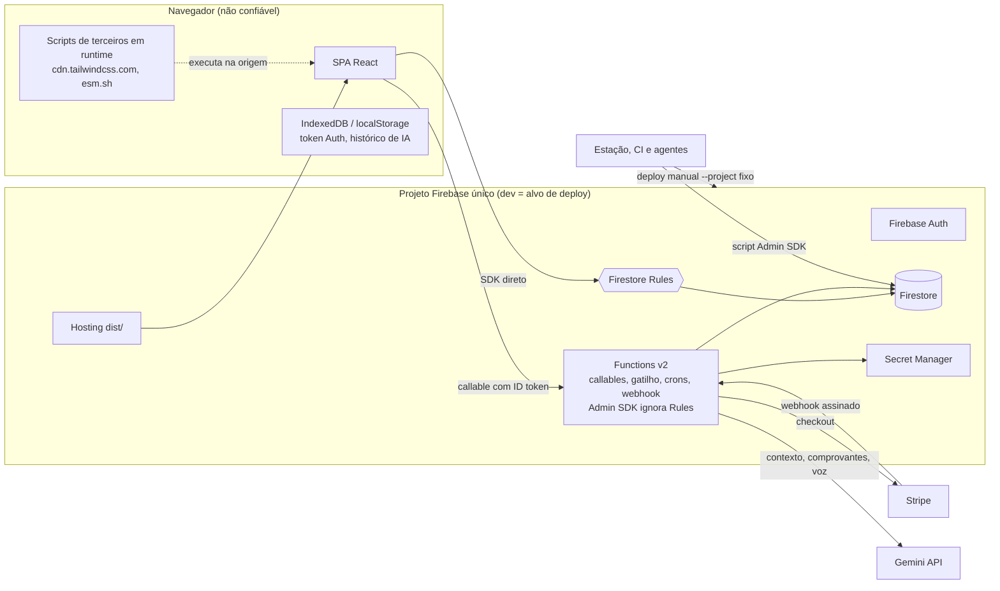

# Modelo de ameaças

Este documento lista os ativos, os atores, as fronteiras de confiança e as ameaças do Minhas Finanças, em ordem de risco. Cada ameaça vem com o vetor concreto no código auditado, o controle que existe, a lacuna e o controle alvo. Baseline: HEAD `9c3ab46`. Os IDs `PR-*`, `D-*`, `E-*` e `R-*` são os do plano mestre [PRODUCTION_READINESS_PLAN.md](PRODUCTION_READINESS_PLAN.md#6-registro-de-blockers). O gate do tema é a skill `multi-tenant-security-review`. Ameaças de plataforma, billing e privacidade também passam por `firebase-production-readiness`, `billing-entitlement-integrity` e `privacy-lgpd-data-lifecycle`. Os controles por camada estão em [SECURITY_MODEL.md](SECURITY_MODEL.md) e o RBAC em [AUTH_RBAC_WORKSPACES.md](AUTH_RBAC_WORKSPACES.md).

> Rótulos: **CURRENT** (existe no HEAD, com evidência `arquivo:linha`), **TARGET** (alvo de produção, ainda não implementado), **GAP** (ID do registro, ou ID de origem da auditoria para MEDIUM/LOW), **DECISION** e **EXTERNAL CONFIGURATION REQUIRED**. Este documento não prova implementação.

## 1. Método e premissas

- **Método:** STRIDE (Spoofing, Tampering, Repudiation, Information disclosure, Denial of service, Elevation of privilege). O risco combina probabilidade (vetor alcançável hoje por qual ator) e impacto (dinheiro, dados pessoais, integridade do ledger, disponibilidade). Escala: Crítico, Alto, Médio, Baixo.
- **Premissa CURRENT:** não há dados reais de produção (`CLAUDE.md`). Mesmo assim, o projeto `sistema-financeiro-pesso-20698` é ao mesmo tempo desenvolvimento e alvo fixo de deploy (`.firebaserc:3`; `package.json:22-26`). Por isso cada ameaça é avaliada como se o produto já estivesse aberto a clientes.
- **Premissa:** a infraestrutura Google (Auth, Firestore, Functions, Hosting, Secret Manager) é confiável como plataforma. As ameaças tratadas são de configuração e de uso, não de falha do provedor.
- **Fora de escopo:** DoS volumétrico de rede, que fica na borda do Google, e segurança física das estações.
- **Manutenção:** todo milestone que feche um GAP desta tabela atualiza a linha correspondente. O P10 refaz o modelo inteiro sobre o HEAD final.

## 2. Ativos

| ID | Ativo | Onde vive (CURRENT) | Propriedade crítica | Impacto se comprometido |
| --- | --- | --- | --- | --- |
| A1 | Dados financeiros por workspace | `workspaces/{workspaceId}/...` (`firestore.rules:990`): `transactions` (`firestore.rules:1053-1095`), `loans`/`clients`/`receivables` (`firestore.rules:1351-1369`), `split_*` (`firestore.rules:1384-1402`), domínios server-only de cartões, metas e investimentos (`firestore.rules:1121-1349`) | Confidencialidade entre tenants; integridade | Vazamento entre clientes; decisões financeiras sobre números falsos |
| A2 | Integridade do ledger e das projeções | `investment_movements`, `credit_card_*`, `cash_report_periods` (`functions/src/cash/periods.ts:31`), trilhas `goal_audit_logs`, `credit_card_audit_logs`, `financial_events`, `investment_event_logs` (`firestore.rules:1146-1149,1156-1159,1181-1184,1238-1242`) | Integridade, não repúdio, reconstrução | Saldo oficial divergente, histórico apagado sem volta (não há backup, PR-BKP-01) |
| A3 | Dados pessoais de usuários e de terceiros | `users/{uid}` (`firestore.rules:1456-1467`); membros com e-mail (`src/components/MembersManagerModal.tsx:53-66`); clientes com CPF/CNPJ, e-mail e telefone (`src/modules/clients/types.ts:3-10`); comprovantes e transcrições enviados à IA (`functions/src/ai/callables.ts:176-197`); histórico de IA no `localStorage` (`src/modules/reports/hooks.ts:343`) | Confidencialidade; ciclo de vida LGPD | Incidente com dados pessoais comunicável à ANPD ([INCIDENT_RESPONSE.md](INCIDENT_RESPONSE.md)) |
| A4 | Estado de assinatura e entitlements | `users/{uid}.planId/isPro/stripe*`, gravado só pelo webhook (`functions/src/webhooks/stripe.ts:97-107`; `firestore.rules:148-157`) | Integridade | Acesso pago sem cobrança, cobrança indevida |
| A5 | Segredos | Secret Manager: `GOOGLE_AI_API_KEY`, `STRIPE_SECRET_KEY`, `STRIPE_WEBHOOK_SECRET`, `STRIPE_ALLOWED_PRICE_IDS`, `APP_ALLOWED_ORIGINS` (`functions/src/ai/callables.ts:24-29`; `functions/src/callables/billing.ts:90-94`; `functions/src/webhooks/stripe.ts:35-39`); chave Gemini histórica que foi para o bundle (`vite.config.ts:14-19`) | Confidencialidade | Custo de terceiros na nossa conta; webhook forjável |
| A6 | Custo de IA e de plataforma | Chamadas ao Gemini (`functions/src/ai/callables.ts:118-124`); leituras do Firestore; instâncias de Functions (`functions/src/shared/runtimeOptions.ts:41-91`) | Disponibilidade financeira | Fatura sem teto |
| A7 | Identidade e sessão | Token do Firebase Auth no navegador, com persistência local padrão (`src/contexts/AuthContext.tsx:83-91`); documentos de membership (`firestore.rules:1010-1051`) | Autenticidade | Sequestro de conta e de todos os workspaces dela |
| A8 | Disponibilidade do produto | Hosting SPA (`firebase.json:25-58`) com dependências de CDN em runtime (`index.html:8,75-92`); Functions em `southamerica-east1` (`functions/src/shared/runtimeOptions.ts:38-44`) | Disponibilidade | Produto fora do ar, ou no ar sem estilo |
| A9 | Integridade do código e da entrega | Repositório, CI (`.github/workflows/quality-gate.yml`), scripts de deploy (`package.json:22-26`), proteções do harness (`.claude/settings.json`, listas `permissions.deny`/`ask` e bloco `sandbox`) | Integridade | Código ou Rules não revisados publicados em produção |

## 3. Atores

| Ator | Capacidade no HEAD (CURRENT) | Ameaças |
| --- | --- | --- |
| Visitante anônimo | Vê só o `LoginView` (`src/App.tsx:686-690`). Alcança o endpoint público do webhook (`functions/src/webhooks/stripe.ts:31-41`). Consegue abrir o modal "Pagamento Aprovado" por query string (`src/modules/billing/components/BillingSuccessModal.tsx:8-10`, COMM-04) | T-05, T-26 |
| Usuário autenticado sem vínculo | Qualquer token é aceito (`firestore.rules:5-7`). Cria workspaces sem limite e vira owner deles (`firestore.rules:991-994`). Chama IA e checkout nos próprios workspaces. Não lê dados de outros tenants (`firestore.rules:9-16`) | T-11, T-12, T-20 |
| `viewer` | Lê dados do workspace (`firestore.rules:435-436`), inclusive pelo catch-all (`firestore.rules:1436-1442`) | T-21 |
| `member` | Cria e edita as próprias `transactions` (`firestore.rules:271`). Grava e apaga livremente `loans`, `clients`, `receivables`, `split_*` e `recurring_*` (`firestore.rules:443-446`). Chama as callables de domínio | T-06, T-07, T-08, T-10, T-13, T-16, T-23 |
| `admin` | Gerencia members que não são owner (`firestore.rules:1021-1041`). Grava e apaga `credit_cards` (`firestore.rules:1107-1119`) | T-06, T-14, T-15 |
| `owner` | Todos os poderes, inclusive conceder `owner` a outro membro (co-owner) e rodar rebuilds | T-14 |
| Ex-membro removido | Perde a leitura quando o documento de membership some (`firestore.rules:9-16`). Mantém cache e histórico de IA no dispositivo | T-25, T-17 |
| Convidado | Não existe convite real para workspace (PR-WS-01). Em Divisão de contas, o convite é um código que qualquer membro consegue ler | T-13, T-15 |
| Operador interno | Tem credenciais amplas no console/CLI do único projeto. Faz deploy manual e usa ferramenta destrutiva versionada | T-01, T-02, T-19 |
| Atacante com token roubado | Usa o token até ele expirar. Não há revogação no código | T-17, T-04 |
| Stripe / webhook forjado | Envia POST ao endpoint público. O segredo tem fallback público | T-05 |
| Cadeia de suprimentos de CDN/CI | Executa script na origem autenticada (`index.html:8`) e altera o gate de CI (`.github/workflows/quality-gate.yml:101,139`) | T-04, T-27 |
| Agente de IA/automação com acesso ao repositório | Roda shell e ferramentas MCP na estação que aponta para o projeto único | T-24, T-01 |

## 4. Fronteiras de confiança

| Fronteira | Controle CURRENT | Fraqueza (GAP) | TARGET |
| --- | --- | --- | --- |
| TB-1 Navegador → Firestore (SDK) | Rules com membership ativa e default deny fora de `workspaces/` e `users/` (`firestore.rules:9-16,990,1456`). Seis suítes de Rules no Emulator e na CI (`.github/workflows/quality-gate.yml:74-110`) | As Rules são a única barreira dos domínios gravados pelo cliente, sem schema em dez coleções (PR-RULES-01) | Escrita financeira `write: false`. Rules como segunda camada ([SECURITY_MODEL.md](SECURITY_MODEL.md)) |
| TB-2 Navegador → callables | `requireWorkspaceRole` e Zod em cartões, metas, IA e divisão de contas (`functions/src/creditCards/callable.ts:46-68`). Investimentos revalidam o papel dentro da transação (`functions/src/investments/infrastructure.ts:152-205`) | Sem App Check (PR-APPCHK-01). `workspaceId` aceita `/` (ENTRY-11). Sem entitlement (PR-ENT-01) | Wrapper único do kernel de P1 (D-ORD-02) |
| TB-3 Stripe → webhook | Assinatura verificada com `rawBody` (`functions/src/webhooks/stripe.ts:52`) | Fallback público do segredo (PR-BILL-05). Sem `event.id` (PR-BILL-06) | Fail-closed, idempotente e ordenado (P2) |
| TB-4 Functions → Gemini | Chave só no backend (`functions/src/ai/callables.ts:24-29,107-116`) | Dados pessoais saem sem base legal nem tier comprovado (PR-AI-01) | Minimização e tier contratado (D-11, E-10) |
| TB-5 Navegador ← CDN de terceiros | Nenhum | Sem CSP, SRI nem `frame-ancestors` (PR-PLAT-03) | Nenhum script de terceiro em runtime, com CSP estrita (P6) |
| TB-6 Estação/CI → projeto | `deploy:firestore` roda as suítes de Rules antes de publicar (`package.json:21-22`) | Projeto único e deploy manual (PR-PLAT-01, PR-REL-01) | Três projetos, CD com aprovação e IAM mínimo (E-01, E-04, E-12) |
| TB-7 Scripts Admin SDK → Firestore | Override com várias flags (`tools/investments/limpar-investimentos.mjs:59,88,238`) | Hard delete do ledger permitido no projeto real (PR-PLAT-02) | Remover a ferramenta ou restringi-la ao Emulator/DEV |
| TB-8 Agente → repositório/harness | Denies e `ask` na árvore de trabalho de P0 (`.claude/settings.json`, listas `permissions.deny`/`ask`), sandbox (`.claude/settings.json`, bloco `sandbox`), proibições (`CLAUDE.md:15-20`) | No HEAD só havia 5 denies (REL-12). A barreira real teria de ser o IAM | IAM sem papel de deploy para agentes (E-04) |

## 5. Ameaças priorizadas (STRIDE)

Ordem: risco decrescente. "Milestone" é onde o controle TARGET fecha, conforme o [plano](PRODUCTION_READINESS_PLAN.md#8-milestones).

### 5.1 Risco crítico

| ID | STRIDE | Ameaça | Vetor concreto no HEAD | Impacto | Controle CURRENT | GAP | Controle TARGET | Milestone |
| --- | --- | --- | --- | --- | --- | --- | --- | --- |
| T-01 | T, D | Deploy acidental em produção | `.firebaserc:3` (projeto único); `package.json:22-26` (`--project` fixo); `functions/package.json:12` (deploy sem gate); `docs/investments/PRODUCTION_DEPLOYMENT_CHECKLIST.md:103,125` (`--project <PROJETO>` não troca o alvo) | Rules, Functions ou Hosting de branch inacabada publicados sobre dados de clientes | Suítes de Rules no predeploy de `deploy:firestore` (`package.json:21-22`); denies do harness (`.claude/settings.json`, lista `permissions.deny`); proibição (`CLAUDE.md:15-16`); D-ORD-04; R-01 | PR-PLAT-01, PR-REL-01; REL-12 | DEV/STAGING/PROD isolados, sem default em PROD; deploy só por CD com aprovação e Workload Identity Federation; nenhum humano ou agente com papel de deploy em PROD (E-01, E-04, E-12; D-19) | P6 |
| T-02 | T, R | Ferramenta destrutiva apagando o ledger | `tools/investments/limpar-investimentos.mjs:59,88` (ID de produção e flag de override); `:143-148` (coleções do ledger); `:352,409` (`lote.delete`) | Histórico patrimonial e espelhos de caixa apagados sem trilha nem restore | Override exige várias flags (`tools/investments/limpar-investimentos.mjs:59,88,238`); teste de guarda (`tests/tools/limpar-investimentos.guard.test.mjs:229`) | PR-PLAT-02 | Remover a ferramenta ou restringi-la a Emulator/DEV, sem override para PROD | P6 |
| T-03 | I | Chave Gemini exposta no bundle público no passado | `git show 39806fb:vite.config.ts:14-15`; `vite.config.ts:14-19` (o comentário confirma a exposição) | Terceiros consomem a cota e a fatura e contornam o rate limit | Hoje a chave está só no backend (`functions/src/ai/callables.ts:24-29`; `vite.config.ts:18-19`; `tests/unit/ai-backend-only.test.ts:33-90`) | PR-AI-02 (R-06) | Revogar a chave antiga e criar uma chave por ambiente restrita à API; registrar a evidência (E-00, D-ORD-06) | P0 (ação externa imediata) |
| T-04 | T, I, E | Script de CDN comprometido ou clickjacking | `index.html:8` (Tailwind Play CDN); `index.html:75-92` (importmap `esm.sh`); `firebase.json:38-57` (só `Cache-Control`) | JS arbitrário na origem autenticada lê o token do Auth e os dados financeiros de todos os workspaces da vítima. A página pode ser emoldurada | Nenhum | PR-PLAT-03 | Tailwind compilado (D-20), dependências empacotadas, fontes auto-hospedadas, CSP estrita, HSTS, `frame-ancestors`, `nosniff`, `Referrer-Policy` | P6 |
| T-05 | S, T, E | Webhook Stripe forjado, replay e fail-open do segredo | `functions/src/webhooks/stripe.ts:9` (fallback `whsec_placeholder`); `:52` (`constructEvent` com o fallback); `:82` (lookup pelo `session.id` do payload); `:49-110` (sem `event.id`); `:40` (`cors: true`); `:60` (sem `livemode`) | Com o segredo ausente, um único pagamento concede `pro` a várias contas. Um evento reentregue fora de ordem reconcede o plano | Assinatura verificada (`functions/src/webhooks/stripe.ts:52`); confere `payment_status` e o preço contra a allowlist (`functions/src/webhooks/stripe.ts:60-107`) | PR-BILL-05, PR-BILL-06, PR-BILL-01 | Segredo sem fallback (500 e log). `stripe_events/{event.id}` na mesma transação do efeito. Ordem por `event.created` ou releitura via API. Checagem de `livemode`. `billing_audit` append-only. Sem CORS (E-05, E-06) | P2 |
| T-06 | T, R | Hard delete malicioso ou acidental de histórico financeiro | `firestore.rules:1097-1105,1351-1369,1384-1402` (`write` inclui delete para member); `firestore.rules:1118` (delete de `credit_cards`); `src/modules/loans/api.ts:256-284`; `src/modules/clients/api.ts:82-89,142-145`; `src/modules/split-bills/api.ts:194-233` | Perda irreversível: não há backup nem trilha | `transactions` nega delete e usa baixa lógica (`firestore.rules:1094`, com teste). Compras, faturas, metas e investimentos são server-only (`firestore.rules:1121-1349`) | PR-RULES-01, PR-LOAN-04, PR-CR-02, PR-SPLIT-02, PR-CC-01, PR-BKP-01 | `write: false` nessas coleções. Cancelamento, arquivamento e estorno por callables com auditoria. PITR e backups (E-07) | P3, P4, P7 |
| T-07 | T | Estado financeiro forjado por member em domínios sem backend | `firestore.rules:1351-1369` (loans, loan_movements, clients e receivables sem schema); `src/modules/loans/api.ts:209-241`; `firestore.rules:1097-1105` e `functions/src/crons/recurring.ts:258-260` (o cron confia em `nextDueDate`); `functions/src/crons/recurring.ts:333,514` (`valorPadrao` cru) | Saldos, status e recebimentos arbitrários. O cron grava lançamento com valor forjado | Só papel e tenant (`firestore.rules:443-446`). Leitura cross-tenant negada, com teste (`tests/firestore/adjacent-modules.rules.integration.test.mjs:129-243`) | PR-LOAN-01, PR-LOAN-07, PR-CR-01, PR-SPLIT-01, PR-REC-01 | Callables transacionais (`createLoan`, `registerLoanPayment`, recebíveis, módulo `splitBills`, recorrentes) e Rules `write: false` ([FINANCIAL_DOMAIN_MODEL.md](FINANCIAL_DOMAIN_MODEL.md)) | P3, P4 |
| T-08 | T | Member editando espelhos de caixa e forjando vínculos | `firestore.rules:67-76` (a allowlist inclui `source`, `creditCard*`, `loan*`); `firestore.rules:89-99` (`value` e `source` mutáveis); `firestore.rules:243-248`; `functions/src/creditCards/registerInvoicePayment.ts:407-428` | O caixa oficial diverge da fatura, e um pagamento real some do fluxo exibido | Allowlist, `type` imutável, investimento negado, `valueCents`/`goalId` negados, delete negado (`firestore.rules:67-98,202-263`; `tests/firestore/m4-hardening.rules.integration.test.mjs:357-767`). Member só altera as próprias (`firestore.rules:271`) | PR-TX-02, PR-TX-01 | `transactions` `write: false`. Callables de caixa em `amountCents`. Espelhos gravados só na transação do domínio de origem | P3 |

### 5.2 Risco alto

| ID | STRIDE | Ameaça | Vetor concreto no HEAD | Impacto | Controle CURRENT | GAP | Controle TARGET | Milestone |
| --- | --- | --- | --- | --- | --- | --- | --- | --- |
| T-09 | T | Corrida de saldo | `src/components/PJLoanDetailsView.tsx:88-101` e `src/modules/loans/api.ts:355-357` (escrita dupla concorrente); `functions/src/crons/creditCardInvoices.ts:249-276` (`update` sem `transaction.get`) | Dupla dedução ou lost update do saldo. Status de fatura sobrescrito com leitura velha | Callables de cartão em `runTransaction` com idempotência (`functions/src/creditCards/callable.ts:46-68`). Investimentos revalidam na transação (`functions/src/investments/infrastructure.ts:152-205`) | PR-LOAN-02, PR-LOAN-03, PR-CC-04 | Pagamento de empréstimo numa única transação de callable. Cron relendo a fatura dentro da transação. Testes de concorrência | P3, P4 |
| T-10 | T | Duplo envio ou replay de operação financeira | `src/components/TransactionModal.tsx:787-791,860` (chave nova por submit); `src/modules/transactions/api.ts:258` (`addDoc` com ID aleatório); `functions/src/callables/billing.ts:136-144` (sem customer existente nem `idempotencyKey`); `src/modules/split-bills/api.ts:146-147,299-300` | Compra ou lançamento duplicado. Duas assinaturas e cobrança em dobro | Idempotência dentro da transação em cartões, metas e investimentos (`functions/src/creditCards/callable.ts:46-68`; `functions/src/goals/operations.ts:187-191`; `functions/src/investments/infrastructure.ts:249-257`) | PR-CC-03, PR-TX-01, PR-BILL-03; SPLIT-10 | Chave estável por intenção. Reserva de idempotência no wrapper do kernel (D-ORD-02). Checkout que reutiliza o customer e bloqueia assinatura ativa | P1, P2, P3, P4 |
| T-11 | D, E | Abuso de custo de IA e criação ilimitada de workspaces | `firestore.rules:991-994` (create exige só `ownerId == uid`); `functions/src/shared/rateLimit.ts:49-66` (chave workspace+ator); `functions/src/ai/callables.ts:118-124,173-174` (sem teto de tokens, cerca de 6 MB por chamada) | Um script cria N workspaces e multiplica a cota de IA (RPTAI-03: cerca de 3.000 chamadas multimodais por hora) | Zod estrito, papel e rate limit transacional de 20/h e 60/h (`functions/src/ai/callables.ts:44-48,128-145,167-171`); `maxInstances: 10` (`functions/src/shared/runtimeOptions.ts:72-77`) | PR-AI-03, PR-ENT-01, PR-WS-05, PR-APPCHK-01 | `createWorkspace` com quota. Quota de IA por usuário e workspace ligada ao plano. App Check com tokens de uso limitado. `maxOutputTokens`, ledger de uso e alerta de orçamento (D-01, D-11, E-02, E-08) | P1, P2, P6 |
| T-12 | E | Plano nunca revogado e quotas só no cliente | `functions/src/webhooks/stripe.ts:60,97-107` (só `checkout.session.completed`, `active` fixo); `src/hooks/usePlan.ts:36-38` (`checkLimit` no cliente) | Acesso pago continua sem cobrança. Limites contornados pelo SDK | O cliente não grava `planId`/`isPro`/`isAdmin`/`stripe*` (`firestore.rules:148-157`; `tests/firestore/m4-hardening.rules.integration.test.mjs:768-824`) | PR-BILL-01, PR-ENT-01, PR-BILL-07 | Máquina de estados da assinatura e entitlements server-side em todos os entrypoints (D-01, D-08, D-ORD-05) ([BILLING_ENTITLEMENTS.md](BILLING_ENTITLEMENTS.md)) | P2 (quotas até P5) |
| T-13 | S, E | Forja de papel de grupo em Divisão de contas | `functions/src/callables/splitGroups.ts:115-137` (autoriza por `split_participants.papel`); `firestore.rules:1389-1392` (member grava participantes); `firestore.rules:1436-1442` (códigos de convite legíveis); `functions/src/callables/splitGroups.ts:222-247` (limite de tentativas revertido) | Qualquer member se declara dono, gera convites e entra em qualquer grupo. A identidade é o nome de exibição | As callables exigem membership ativa no workspace (`functions/src/callables/splitGroups.ts:109-113,187-191`) | PR-SPLIT-04; SPLIT-14 | Papel de grupo gravado só pelo backend. Identidade por `uid`. Rules negam escrita em `split_participants`. Convites backend-owned (D-14) | P4 |
| T-14 | E, D | Titular trancado fora do workspace ou escalada via membership | `firestore.rules:13-14,27-33` (owner-by-parent depende de `status`); `firestore.rules:1020-1041` (`status` livre; owner altera owner); `src/components/MembersManagerModal.tsx:23-28` (a UI oferece `owner`) | Um co-owner ou admin desativa o `ownerId` e assume o workspace | Rules M4.C: enum de papel, `uid == docId`, sem autopromoção, `owner` concedido só por owner (`firestore.rules:1010-1051`; `tests/firestore/m4-hardening.rules.integration.test.mjs:257-356,548`) | PR-WS-04, PR-WS-02, PR-WS-03 | `changeRole`, `removeMember` e `transferOwnership` por callable. Fonte única de titularidade. `members` `write: false` (D-03, D-04) | P1 |
| T-15 | S | Membership sem consentimento (convite com UID fictício) | `src/components/MembersManagerModal.tsx:53-66` (`fakeUid` é o e-mail sem símbolos); `firestore.rules:1021-1026` (aceita `memberId` arbitrário) | Um admin adiciona um UID conhecido sem aceite. O convidado real nunca obtém acesso | Só owner/admin gravam `members` (`firestore.rules:1010-1051`) | PR-WS-01 | Convite com token de uso único (hash), expiração, e-mail verificado e aceite por `request.auth.uid` na mesma transação da quota e da auditoria (D-05, E-11) | P1 |
| T-16 | I | Exfiltração via IA e terceiros; prompt injection | `functions/src/ai/callables.ts:227-238` (comprovante inteiro vai ao modelo); `:55-70` (contexto livre do cliente); `:93-103` (pergunta interpolada); `src/modules/reports/hooks.ts:343` (`localStorage` sem uid); `src/components/TransactionModal.tsx:723-734` (Web Speech) | CPF e nomes de terceiros saem sem base legal. Uma categoria criada por member injeta instruções no prompt do owner. O histórico vaza entre usuários e workspaces | Chave só no backend. Logs sem conteúdo (`functions/src/ai/callables.ts:151-158`). Resposta renderizada como texto (`src/components/ReportsAIChat.tsx:70-83`) | PR-AI-01, PR-AI-04, PR-AI-05, PR-PRIV-01 | Contexto montado no servidor, `systemInstruction` com dados delimitados, `responseSchema` + Zod, tier contratado, minimização, histórico fora do `localStorage` (D-11, E-09, E-10; [SUBPROCESSORS.md](SUBPROCESSORS.md)) | P5, P8 |
| T-17 | S | Sessão roubada sem revogação | Nenhum `revokeRefreshTokens`, `checkRevoked` ou `setCustomUserClaims` em `functions/src` e `src` (busca no HEAD: 0); persistência local sem expiração (`src/contexts/AuthContext.tsx:83-91`); o token fica exposto a T-04 | O atacante mantém o acesso. A aplicação não consegue suspender a conta | Remover a membership corta o workspace na próxima requisição (`firestore.rules:9-16`; `functions/src/creditCards/auth.ts:81-87`). Desativar no console é EXTERNAL e o token vigente continua válido (AUTH-09) | AUTH-09, AUTH-17, PR-ADMIN-01, PR-OBS-02 | Callable de suspensão (`disabled`, `revokeRefreshTokens`, `status`, auditoria). `checkRevoked` em operações sensíveis. MFA para owners/admins (D-06, E-03) | P1, P7 |
| T-18 | S, D | Credenciais e build E2E no Hosting | `src/contexts/AuthContext.tsx:94-114` (credenciais fixas e auto-cadastro); `src/lib/firebase.ts:47-62` (nenhuma trava E2E ⇒ emulador); `package.json:9,27` (mesmo `outDir`); `firebase.json:25-30` (Hosting sem predeploy) | Bundle de produção apontando para `127.0.0.1` (produto fora do ar). Se Email/Senha estiver habilitado em PROD, as credenciais fixas criam contas | O login E2E lança erro fora do modo E2E (`src/contexts/AuthContext.tsx:98-99`) | PR-AUTH-04 | Login E2E fora do bundle de produção, trava no build, `outDir` separado, deploy só pela CI | P6 |
| T-19 | E, R | Operador interno ou admin sem ferramenta auditada | `src/contexts/AuthContext.tsx:55-61` (`isAdmin` lido no cliente); `functions/src/index.ts:13-37` (nenhuma callable administrativa); `functions/src/shared/runtimeOptions.ts:41-91` (sem `serviceAccount`) | Suporte feito à mão no console com credenciais amplas e sem registro. Uma falha de execução herda a conta padrão de runtime | `isAdmin` não é autoconcedível (`firestore.rules:148-157`; `tests/firestore/m4-hardening.rules.integration.test.mjs:784`) | PR-ADMIN-01; FIRE-09 | Custom claim `platformAdmin`, callables mínimas com `admin_audit_logs` ou remoção do painel (D-10). Service accounts dedicadas. MFA humano (E-04) | P6, P7 |

### 5.3 Risco médio

| ID | STRIDE | Ameaça | Vetor concreto no HEAD | Impacto | Controle CURRENT | GAP | Controle TARGET | Milestone |
| --- | --- | --- | --- | --- | --- | --- | --- | --- |
| T-20 | I, E | Cross-tenant / IDOR | `workspaceId` sem rejeitar `/` em 18 callables (`functions/src/creditCards/contracts.ts:3`; `functions/src/goals/contracts.ts:5`); path interpolado (`functions/src/creditCards/auth.ts:59-62`); `create` de workspace com ID livre (`firestore.rules:991-994`) permite recriar um pai removido e herdar as subcoleções órfãs (risco latente, RULES-06) | Pseudo-tenant aninhado no próprio workspace e rate limit zerado (ENTRY-11). Takeover de dados órfãos se uma exclusão futura não deixar tombstone. Nenhum achado descreve vazamento atual entre tenants | Rules por caminho com membership ativa (`firestore.rules:9-16`) e default deny (`firestore.rules:990,1456`). `requireWorkspaceRole` (`functions/src/creditCards/auth.ts:54-125`). Investimentos rejeitam `/` e exigem que o workspace do payload seja o autorizado (`functions/src/investments/contracts.ts:12-17`; `functions/src/investments/infrastructure.ts:239-248`). Testes cross-tenant (`tests/firestore/m4-hardening.rules.integration.test.mjs:246`; `tests/firestore/adjacent-modules.rules.integration.test.mjs:129-243`) | ENTRY-11, WS-15, PR-WS-05 | Schema único de ID sem `/` e autorização relida na transação no kernel (D-ORD-02). `createWorkspace` por callable com `create: false` nas Rules. Exclusão com tombstone que nunca libera o ID (P8). Suíte cross-tenant por coleção com todos os papéis | P1, P8 |
| T-21 | I | Leitura intra-workspace além do papel | Catch-all de leitura (`firestore.rules:852-877,1436-1442`) expõe `activity_logs` e `split_invites` a qualquer membro, inclusive `viewer`; `clients` com PII legível por todos (`firestore.rules:1361-1364`); `viewer` lê valores de investimento pelo espelho (`firestore.rules:1054`) | PII e detalhes financeiros para papéis menores. Coleções futuras, como convites e chat, nascem legíveis (MSG-02) | Prefixos backend-owned negados (`firestore.rules:852-877`). O tier sensível de investimentos é só owner/admin (`firestore.rules:1190-1349`) | PR-RULES-02, PR-CR-05; RULES-09, INV-04 | Um `match` explícito por coleção, sem catch-all. Matriz de leitura por papel (D-02) e visibilidade de PII de clientes por papel (D-24) | P6, P8 |
| T-22 | R | Repúdio: alterações sem autor nem trilha | `src/modules/transactions/api.ts:313-330` (edição sem trilha); `src/modules/workspaces/api.ts:249-252` (remoção por hard delete); `functions/src/triggers/transactions.ts:108` (atribui ao criador, não ao ator); `functions/src/goals/callables.ts:53-55` (erro sem log) | Não dá para reconstruir quem mudou o quê, nem sustentar disputa ou comunicação à ANPD | Trilhas server-only em metas, cartões e investimentos (`firestore.rules:1146-1149,1156-1159,1181-1184,1238-1242`). Baixa lógica com `voidedBy` (`firestore.rules:202-263`) | PR-TX-05, PR-WS-02, PR-OBS-01; ENTRY-17 | Gravador de auditoria append-only do kernel usado por toda callable. Logger estruturado com correlation ID ([OBSERVABILITY.md](OBSERVABILITY.md)) | P1, P3, P7 |
| T-23 | D | Esgotamento de custo e leitura | `functions/src/creditCards/observability.ts:180-190,266-296` (uma notificação por falha, com ID vindo da chave do cliente); callables de cartão e metas sem rate limit (ENTRY-12); `src/modules/notifications/api.ts:24-25` (sem `limit`, polling de 30 s); `src/modules/transactions/api.ts:121,127` (até 20 mil documentos) | Custo de Firestore sem teto e degradação para o workspace inteiro | `maxInstances` por classe (`functions/src/shared/runtimeOptions.ts:41-91`). `list` limitado em `investment_*` e `cash_report_periods` (`firestore.rules:473-477,1277-1291`) | PR-NOTIF-01, PR-RPT-02; NOTIF-04, ENTRY-12 | `limit` + cursor, TTL, rate limit em toda callable pelo kernel, alerta de orçamento (E-08) | P1, P5 |
| T-24 | T, E | Agente de IA/automação alterando produção | No HEAD, `.claude/settings.json` tinha 5 denies (REL-12); configuração local das estações (`.env.local`, não versionado): NÃO VERIFICADO; o alvo fixo de deploy está em `package.json:22-26` e `.firebaserc:3` | Deploy, escrita por MCP, leitura de segredo ou teste enfraquecido para obter PASS | Denies ampliadas e `ask` para o MCP do Firebase na árvore de trabalho de P0 (`.claude/settings.json`, listas `permissions.deny`/`ask`). Sandbox (`.claude/settings.json`, bloco `sandbox`). Proibições (`CLAUDE.md:15-20`). Gate `regression-release-gate` | REL-12, PR-PLAT-01 | Denies versionadas. IAM sem papel de deploy nem de escrita em PROD para agentes e desenvolvedores (E-04). Estações apontando só para DEV/Emulator | P0, P6 |
| T-25 | I | Ex-membro com acesso residual | Remoção só em `members`; o espelho do removido não é apagado (`src/modules/workspaces/api.ts:236-264`; `firestore.rules:1478-1485`); histórico de IA sem uid e logout sem limpeza (`src/modules/reports/hooks.ts:343-358`; `src/contexts/AuthContext.tsx:116-122`) | Dados do workspace ficam no dispositivo. O workspace segue listado sem acesso | Remoção corta a leitura (`firestore.rules:9-16`). O backend recusa membership inativa (`functions/src/creditCards/auth.ts:81-87`). Teste de removido sem leitura (`tests/firestore/m4-hardening.rules.integration.test.mjs:493-507`) | PR-WS-02, PR-AI-04; WS-11, AUTH-11 | `removeMember` com remoção lógica, auditoria e índice mantido pelo backend. Logout que limpa cache e `localStorage` | P1, P5 |

### 5.4 Risco baixo

| ID | STRIDE | Ameaça | Vetor concreto no HEAD | Impacto | Controle CURRENT | GAP | Controle TARGET | Milestone |
| --- | --- | --- | --- | --- | --- | --- | --- | --- |
| T-26 | I, S | Enumeração de e-mail e conta com e-mail não verificado | Provedores habilitados em PROD desconhecidos (AUTH-08); o caminho E2E cria usuário em `auth/invalid-credential` (`src/contexts/AuthContext.tsx:107-108`); `signedIn()` aceita qualquer token (`firestore.rules:5-7`) | Descobrir e-mails cadastrados. Conta com e-mail de terceiro aceita pelas Rules e pelo checkout | A UI só oferece Google (`src/contexts/AuthContext.tsx:83-91`; `src/components/auth/LoginView.tsx:26-37`) | AUTH-08, ENTRY-23 | Provedores restritos por ambiente, proteção contra enumeração e blocking functions exigindo e-mail verificado (D-06). **EXTERNAL CONFIGURATION REQUIRED** E-03, NÃO VERIFICADO | P1, P6 |
| T-27 | T | Cadeia de suprimentos do CI | `.github/workflows/quality-gate.yml:101,139` (`firebase-tools@latest`); `.github/workflows/quality-gate.yml:39,79,117` (actions por tag, sem `permissions:`) | Gate alterado sem mudança no repositório. Com CD, vira vetor de deploy | CI sem segredos (`.github/workflows/quality-gate.yml:26-162`) | REL-11, FIRE-13 | Pinagem por SHA, `permissions` mínimas, auditoria de dependências e secret scanning (E-12) | P6 |

## 6. Isolamento de tenant: estado consolidado

- **CURRENT:** nenhum achado da auditoria descreve vazamento atual de dados entre tenants. Os auditores de Auth, Clientes/Recebíveis e Recorrentes registraram explicitamente o isolamento por caminho. O cron de recorrentes escreve só no workspace do próprio documento (`functions/src/crons/recurring.ts:436`). A escalada cross-tenant em Divisão de contas (INV-P2-037) já está corrigida. O isolamento de leitura tem teste no Emulator (`tests/firestore/m4-hardening.rules.integration.test.mjs:246`; `tests/firestore/goals.rules.integration.test.mjs:101-151`; `tests/firestore/adjacent-modules.rules.integration.test.mjs:129-243`). O risco latente é o takeover de pai órfão (RULES-06, T-20).
- **GAP:** os riscos reais estão **dentro** do workspace: um member com poder de escrita e exclusão sobre dados autoritativos (T-06, T-07, T-08), papéis forjáveis (T-13, T-14) e leitura além do papel (T-21). Também faltam testes de escrita cross-tenant em `members` e nas coleções adjacentes (PR-WS-06, PR-REL-02).
- **TARGET:** o kernel de P1 (D-ORD-02) relê membership e papel dentro da transação, sem fallback `ownerId`, e rejeita IDs com `/`. As Rules viram segunda camada com `write: false` em dado autoritativo. Cada coleção ganha suíte de Emulator com todos os papéis, um usuário sem vínculo, um ex-membro e outro tenant.

## 7. Controles alvo verificados por teste

Cada controle TARGET só conta como fechado com teste que falharia sem ele (skill `regression-release-gate`).

| Ameaças | Teste obrigatório (TARGET) | Milestone |
| --- | --- | --- |
| T-06, T-07, T-08, T-21 | Rules no Emulator negando escrita e delete do cliente em cada coleção autoritativa, para todos os papéis e para um tenant alheio | P3, P4, P6 |
| T-09, T-10 | Integração no Emulator com chamadas concorrentes e repetidas da mesma intenção: um único efeito | P3, P4 |
| T-05, T-12 | Webhook com segredo ausente (500, sem efeito), assinatura inválida, `event.id` repetido, evento fora de ordem e `livemode` errado | P2 |
| T-11, T-23 | Quota e rate limit por usuário e workspace; criação de workspace acima da quota negada no servidor | P1, P2, P5 |
| T-13, T-14, T-15, T-20, T-25 | Matriz RBAC: co-owner/admin sobre o titular, convite com e-mail divergente ou expirado, `workspaceId` com `/`, ex-membro | P1, P4 |
| T-04, T-18 | Build de produção falha com flag E2E/emulador. Teste dos headers de Hosting (CSP, `frame-ancestors`). Bundle sem domínios de CDN em runtime | P6 |
| T-16 | Contexto da IA montado só no servidor. Saída fora do schema rejeitada. Logout limpa o armazenamento local | P5 |
| T-17 | Conta suspensa recebe negação em callable sensível mesmo com token ainda não expirado | P1, P7 |

## 8. Decisões e configuração externa que afetam o modelo

- **DECISION** (pendentes, [plano §10](PRODUCTION_READINESS_PLAN.md#10-decisões-pendentes-decision)): D-02 (`viewer`), D-03/D-04 (owners e poderes do admin), D-05 (convite), D-06 (provedores, MFA, sessão), D-10 (painel admin), D-11 (IA), D-14 (participantes de divisão), D-19 (mapeamento de ambientes), D-20 (Tailwind compilado), D-24 (PII de clientes), D-32 (severidade, página de status, break-glass), D-33 (rollout do App Check).
- **EXTERNAL CONFIGURATION REQUIRED** (estado NÃO VERIFICADO, [plano §11](PRODUCTION_READINESS_PLAN.md#11-configuração-externa-necessária-external-configuration-required)): E-00 (rotação da chave Gemini), E-01 (projetos), E-02 (App Check), E-03 (Auth: provedores, enumeração, domínios, MFA), E-04 (IAM), E-05 (segredos por ambiente), E-06 (Stripe), E-08 (alertas e orçamento), E-12 (GitHub).
- A resposta quando uma destas ameaças se materializa está em [INCIDENT_RESPONSE.md](INCIDENT_RESPONSE.md).
